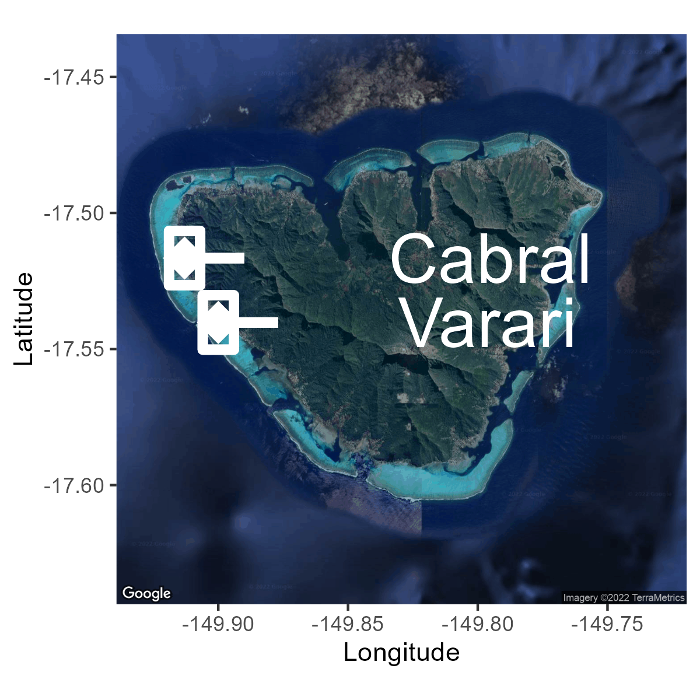

# Community Functional Diversity

This repository holds the data, analyses, and figures for a master degree's thesis project at California State University, Northridge by Danielle Barnas under the advisemnt of Dr. Nyssa Silbiger.  Data were collected in Mo'orea, French Polynesia along the western shore fringing coral reef in Ha'apiti. Data, scripts, and output are related to a benthic community composition study on two coral reefs.  Community is analyzed for species and functional trait diversity of coral reefs impacted by submarine groundwater discharge (SGD).

Map of Mo'orea depicting two survey locations: Cabral and Varari  

[Data](Data/)  
- Site characteristics at each survey point (i.e., rugosity, distance from seepage point, substrate type, CT logger depth) from July 2022, and data dictionary describing parameters.
    - [Full_Metadata.csv](Data/Full_Metadata.csv)
    - [Site_Metadata_Data_Dictionary.csv](Data/Site_Metadata_Data_Dictionary.csv)
- Survey metadata for each survey point (i.e., date, time, photoID, raw rugosity, notes sand conditions) from July 2022.
    - [Survey_Metadata.csv](Data/Surveys/Survey_Metadata.csv)
- Biogeochemical and *Turbinaria ornata* tissue nitrogen data collected in August 2021 (dry season biogeochemistry), March 2022 (wet season biogeochemistry), and July 2022 (*T. ornata*). Data are processed either as biogoechemical means or coefficients of variance across sample seasons.
    - [Nutrient_Processed_CV.csv](Data/Biogeochem/Nutrient_Processed_CV.csv)
    - [Nutrient_Processed_MeanSeason.csv](Data/Biogeochem/Nutrient_Processed_MeanSeason.csv)
- Organization and assignment of species into taxonomic or functional groups.
    - [Distinct_Taxa.csv](Data/Surveys/Distinct_Taxa.csv)

[Scripts](Scripts/)  
- Cleaning and organization of all biogeochemical parameters and *Turbinaria ornata* tissue Nitrogen samples from August 2021 (dry season biogeochemistry), March 2022 (wet season biogeochemistry) and July 2022 (*T. ornata*).
    - [Full_Nutrient_Processing.R](Scripts/Full_Nutrient_Processing.R)
- Cleaning and organization of all site characteristics (i.e., rugosity, distance from seepage point, substrate type, CT logger depth) from July 2022.
    - [Site_Metadata.R](Scripts/Site_Metadata.R)
- Species accumulation curve assessing whether benthic community composition surveys successfully captured the majority of species available within each reef community in July 2022.
    - [Sp_Accumulation_Curve_2022.R](Scripts/Sp_Accumulation_Curve_2022.R)
- Processing and analyses of species richness and taxonomic groups along the SGD gradient. Analyses include linear regressions, PCA, nMDS and perMANOVA to assess direct or indirect influences of biogeochemistry, nutrients, or site characteristics/structure.
    - [RegressionAnalysis_Varari_noSeep13](https://raw.githack.com/dbarnas/Community_Functional_Diversity/main/Scripts/RegressionAnalysis_Varari_noSeep13.html)  

[Output](Output/)  

- [Species Accumulation Curve (Varari)](Output/Species_Accumulation_Varari.pdf)
- [*T. ornata* tissue Nitrogen ~ CV Silicate (umol L-1) Regression](Output/Tissue_N_Silicate_Figures_CV.pdf)
- [PCA](Output/PCA)
- [nMDS](Output/nMDS)

Map of Varari suvey locations

Analyses for functional entity diversity are adapted from Teixido et al. 2018 (DOI: 10.1038/s41467-018-07592-1)
- [GitHub Link Here](https://github.com/9nuria/Teixidoetal_Functional_Diversity_NatComms/tree/v1.0.0)

