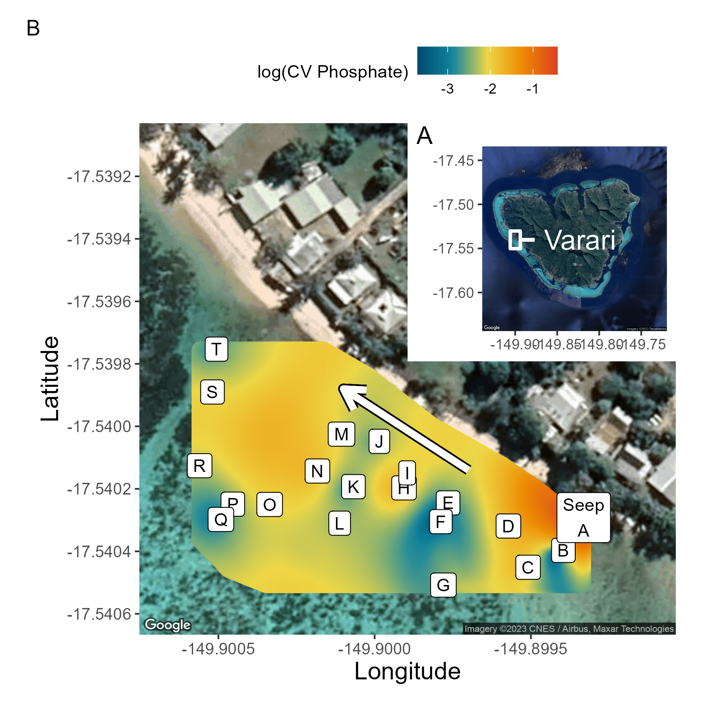
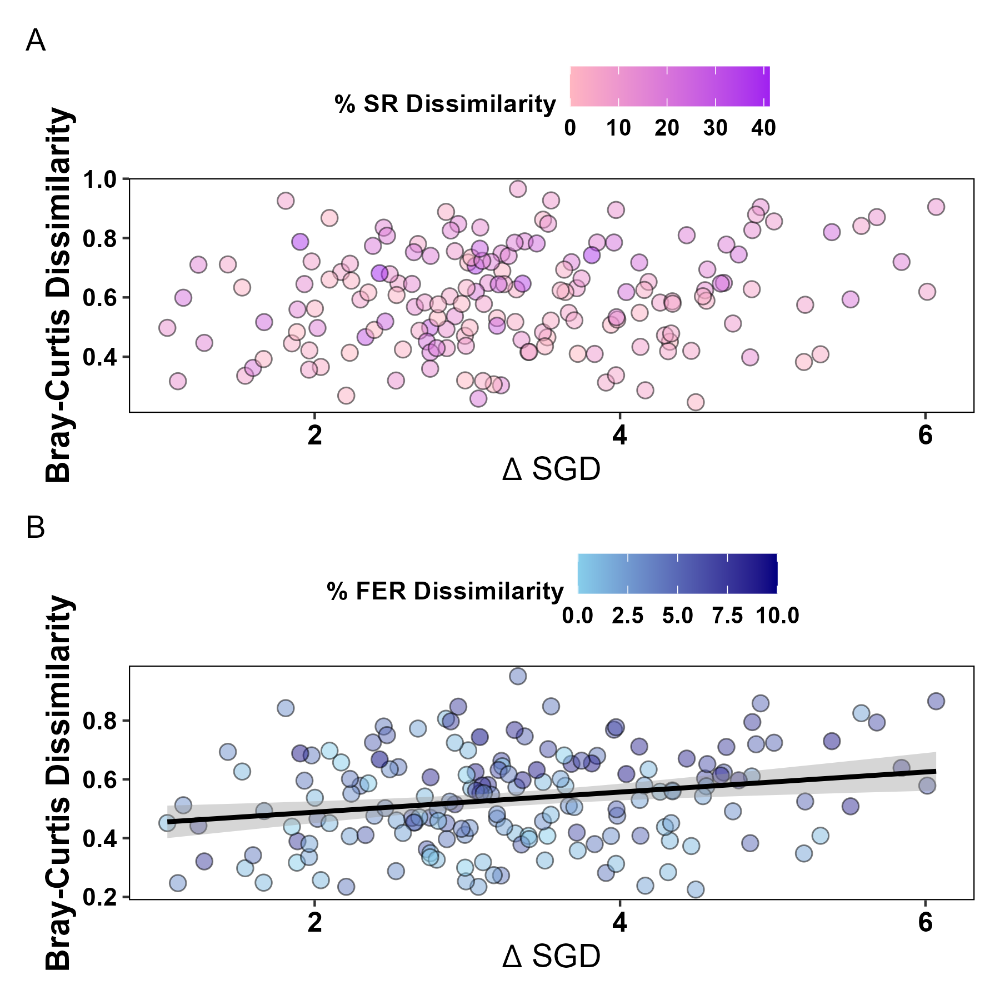

# Community Functional Diversity

This repository holds the data, analyses, and figures for a master degree's thesis project at California State University, Northridge by Danielle Barnas under the advisemnt of Dr. Nyssa Silbiger.  Data were collected in Mo'orea, French Polynesia along the western shore fringing coral reef in Ha'apiti. Data, scripts, and output are related to a benthic community composition study on two coral reefs.  Community is analyzed for species and functional trait diversity of coral reefs impacted by submarine groundwater discharge (SGD).

[Data](Data/)  
- Site characteristics at each survey point (i.e., rugosity, distance from seepage point, substrate type, CT logger depth) from July 2022, and data dictionary describing parameters.
    - [Full_Metadata.csv](Data/Full_Metadata.csv)
    - [Site_Metadata_Data_Dictionary.csv](Data/Site_Metadata_Data_Dictionary.csv)
- Biogeochemical and *Turbinaria ornata* tissue nitrogen data collected in August 2021 (dry season) and March 2022 (wet season).
    - [Nutrients_Processed_All.csv](Data/Biogeochem/Nutrients_Processed_All.csv)
- Organization and assignment of species into taxonomic or functional groups.
    - [Species Functional Entities](Data/Species_FE.csv)
    - [Species Relative Abundances](Data/Species_Abundances_wide.csv)
    - [Distinct Functional Entities](Data/Distinct_FE.csv)

[Scripts](Scripts/)  
- Cleaning and organization of all biogeochemical data and *Turbinaria ornata* tissue Nitrogen samples from August 2021 (dry season), March 2022 (wet season) and July 2022 (*T. ornata* only).
    - [Full_Nutrient_Processing.R](Scripts/Full_Nutrient_Processing.R)
- Primary figures from chapter 1 found in Scripts/ labeled as Fig#_xxx.R, while tables and many supplemental figures are contained within the following markdown file.
    - [Thesis_Figures.Rmd (raw)](Scripts/Thesis_Figures.Rmd)
    - [Thesis_Figures.html (Markdown view)](https://raw.githack.com/dbarnas/Community_Functional_Diversity/main/Scripts/Thesis_Figures.html)

[Output](Output/)  

Figure 1. Map of Moorea, French Polynesia and experimental site with survey locations, displayed across the gradient of the coefficient of variation of phosphate (µmol/L).  

Figure 2. Delta corrected AIC values for models testing SGD parameter influence on community diversity metrics (species richness, functional entity richness, and functional entity volume); summary plot of CV biogeochemical parameters experienced across the reef.  

Figure 3. Scatter plots displaying polynomial regressions of the coefficient of variation of phosphate (µmol/L) against community diversity metrics (species richness, functional entity richness, and functional entity volume).  

Figure 4. Bar plots of percent cover for functional traits within each functional group at survey locations, arranged by increasing coefficient of variation of phosphate (µmol/L).  

Figure 5. PCoA analysis of functional entity presence at each survey location along the SGD gradient, colored and arranged by increasing coefficient of variation of phosphate (µmol/L); traits from each functional entity displayed by functional groups along PCoA axes.

Figure 6. Pairwise scatter plot displaying linear regressions of dissimilarity matrices: SGD parameters on community composition along the reef, calculated from an analysis of similarity (ANOSIM).

Analyses for functional entity diversity are adapted from Teixido et al. 2018 (DOI: 10.1038/s41467-018-07592-1)
- [GitHub Link Here](https://github.com/9nuria/Teixidoetal_Functional_Diversity_NatComms/tree/v1.0.0)

